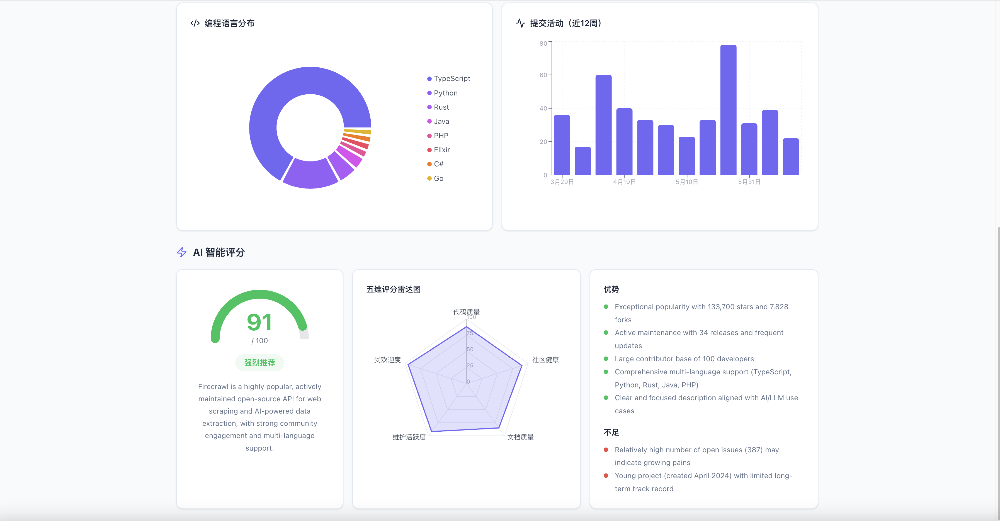

# GitHub 仓库体检工具

输入任意公开 GitHub 仓库地址，一键获取项目健康度报告——Star 数、Fork 数、语言分布、提交活动趋势，以及 AI 智能评分。

## 功能特性

- **核心指标**：Star / Fork / Watcher / Issue / Contributor / Release 数，一目了然
- **可视化图表**：
  - 编程语言分布饼图（环形图）
  - 近一年提交活动柱状图
  - 五维评分雷达图（代码质量 / 社区健康度 / 文档完善度 / 维护活跃度 / 受欢迎程度）
- **AI 智能评分**：基于 DeepSeek 大模型分析，输出综合得分、优劣势评价和推荐等级
- **错误友好**：无效 URL、不存在的仓库、API 限流均有清晰提示

## 页面预览

### 首页


### 分析结果


## 技术栈

| 层级 | 技术 |
|------|------|
| 前端 | React 18 + Vite 6 + Recharts |
| 后端 | Python 3.13 + FastAPI + httpx |
| AI | DeepSeek Chat API（OpenAI SDK） |
| 数据源 | GitHub REST API v3 |

## 项目结构

```
.
├── backend/
│   ├── main.py         # FastAPI 应用入口
│   ├── github_api.py   # GitHub API 客户端
│   ├── ai_scorer.py    # DeepSeek AI 评分模块
│   └── requirements.txt
├── frontend/
│   ├── package.json
│   ├── vite.config.js  # 开发代理配置
│   ├── index.html
│   └── src/
│       ├── main.jsx
│       ├── App.jsx     # 主组件（含所有子组件）
│       └── index.css
└── start.sh            # 一键启动脚本
```

## 快速开始

### 环境要求

- Python 3.8+
- Node.js 18+
- DeepSeek API Key（可选，使用默认 Key 也可运行）

### 1. 安装后端依赖

```bash
cd backend
pip install -r requirements.txt
```

### 2. 配置 API Key（可选）

```bash
# DeepSeek API Key（AI 评分），默认已内置一个可用 Key
export DEEPSEEK_API_KEY="sk-xxx"

# GitHub Personal Access Token（提升 API 限额至 5000次/小时）
# 不配置也能用，但限额仅 60次/小时
export GITHUB_TOKEN="github_pat_xxx"
```

### 3. 安装前端依赖

```bash
cd frontend
npm install
```

### 4. 启动服务

```bash
# 终端1：启动后端（端口 8000）
cd backend
python -m uvicorn main:app --host 0.0.0.0 --port 8000

# 终端2：启动前端（端口 5173）
cd frontend
npx vite --host 0.0.0.0 --port 5173
```

或使用一键启动脚本：

```bash
chmod +x start.sh
./start.sh
```

### 5. 打开浏览器

访问 `http://localhost:5173`，输入 GitHub 仓库地址即可体检。

## API 接口

| 方法 | 路径 | 说明 |
|------|------|------|
| GET | `/api/health` | 健康检查 |
| POST | `/api/analyze` | 分析仓库 |
| GET | `/docs` | Swagger API 文档 |

### 请求示例

```bash
curl -X POST http://localhost:8000/api/analyze \
  -H "Content-Type: application/json" \
  -d '{"url": "https://github.com/facebook/react"}'
```

### 响应示例

```json
{
  "repo": {
    "full_name": "react/react",
    "stars": 245941,
    "forks": 51064,
    "language": "JavaScript",
    …
  },
  "languages": [
    {"name": "JavaScript", "percentage": 58.3},
    {"name": "TypeScript", "percentage": 25.1},
    …
  ],
  "commit_activity": [{"week": 1761436800, "total": 18}, …],
  "ai_score": {
    "overall_score": 97,
    "verdict": "highly-recommended",
    "summary": "React is a world-class, highly maintained UI library…",
    "strengths": ["…"],
    "weaknesses": ["…"],
    "scores": {
      "code_quality": 98,
      "community_health": 95,
      "documentation": 90,
      "maintenance": 98,
      "popularity": 100
    }
  }
}
```

## 评分说明

| 维度 | 评估标准 |
|------|----------|
| 代码质量 | 项目结构、语言选择、描述质量 |
| 社区健康度 | 贡献者数量、Issue 活跃度、社区参与 |
| 文档完善度 | 描述完整性、许可证声明、README 质量 |
| 维护活跃度 | 更新频率、发布节奏、代码活跃程度 |
| 受欢迎程度 | Star/Fork 数量、社区影响力 |

## License

MIT
